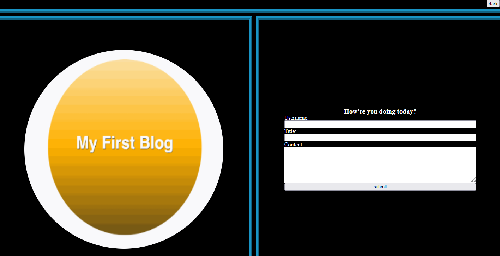
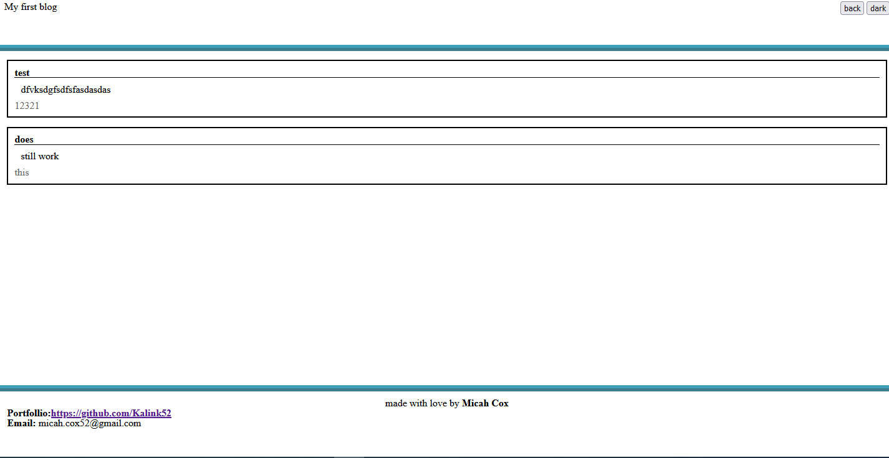

# Foobar

## Usage
[https://kalink52.github.io/Blog/](https://kalink52.github.io/Blog/)

Input information into the username, title, and content areas 

and it will apppear, formatted on the next page

## Contributing

Pull requests are welcome. For major changes, please open an issue first
to discuss what you would like to change.

Please make sure to update tests as appropriate.

## License

[MIT](https://choosealicense.com/licenses/mit/)